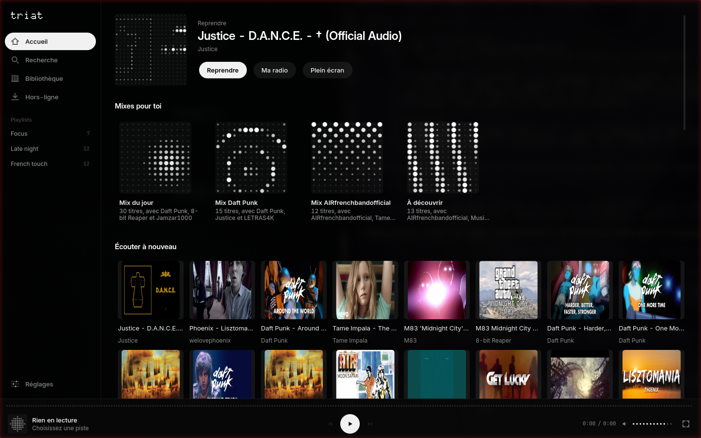
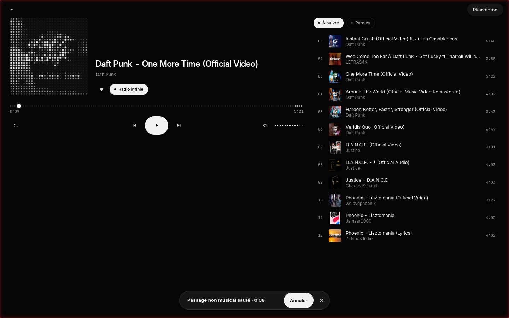
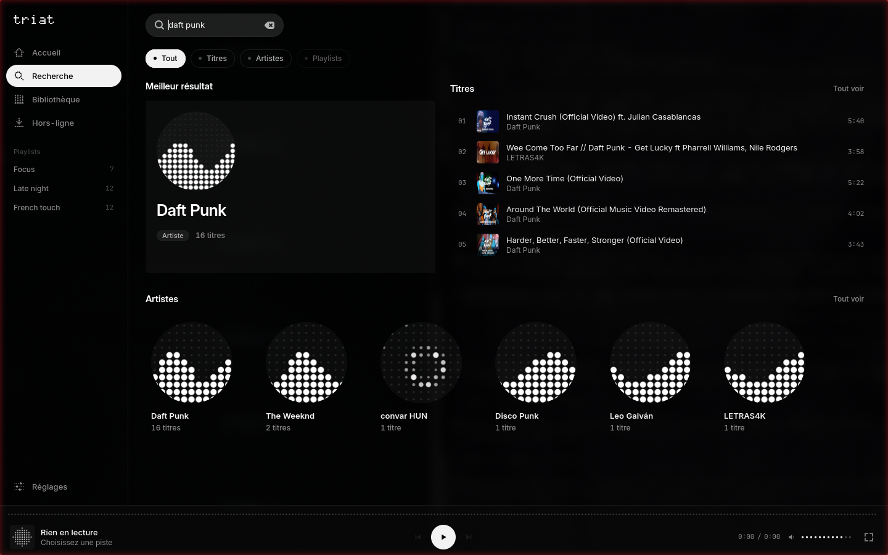
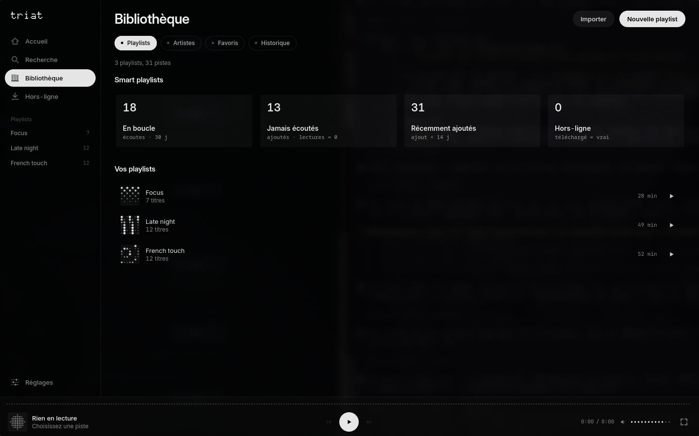
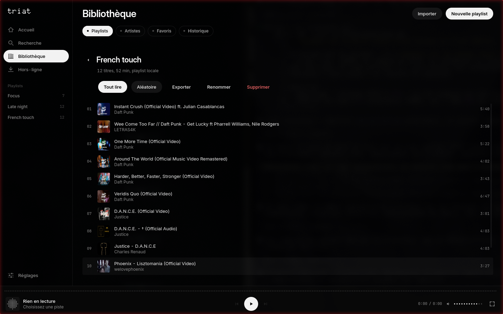
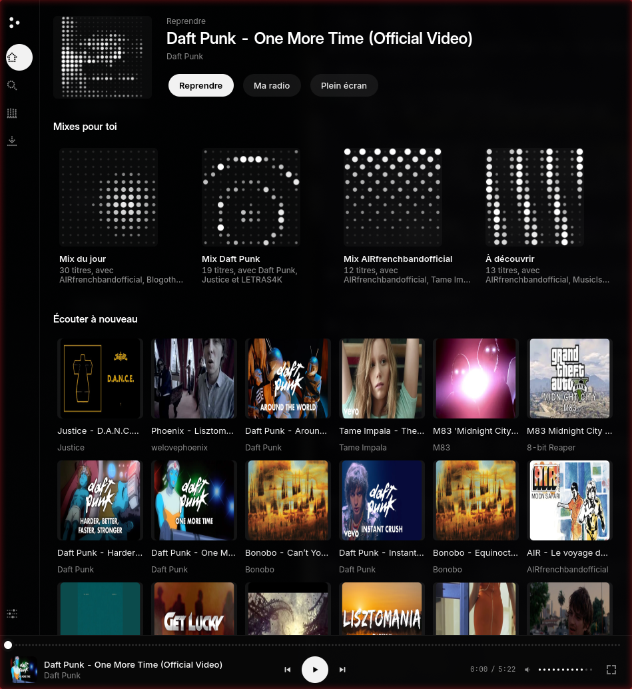

<p align="center">
  
</p>

# Triat

A little music player for Linux that plays music from YouTube, without ads.
It skips the talking bits and intros with SponsorBlock, and it's made to sit
nicely in a Hyprland setup (I use it with the
[Nothing OS dotfiles](https://github.com/0xbbuddha/dotfiles_nothing_os)).

**To be upfront: this is vibe coded.** I'm not a developer. I explained what I
wanted to an AI (Claude), it wrote most of the code, and I tested it on my own
PC every day until it felt right. It works well for me, but keep that in mind
before trusting it with anything important. Also, the code comments are in
French.



## What it does

- Search YouTube and play songs, with a queue, shuffle and repeat
- A radio that keeps going when the queue runs out
- Keeps playing when you close the window, like a normal music app
- Playlists, favourites, history, and a few automatic playlists
- Import a `.txt` of YouTube links or an `.m3u`, export them back
- Synced lyrics, a 10-band equaliser, SponsorBlock
- Offline downloads, a mini player, and full screen with the video or a dot matrix
- Media keys and `playerctl` work (MPRIS)
- Optional: use your browser cookies to get your own YouTube recommendations

| Now playing | Search |
|:---:|:---:|
|  |  |
| **Library** | **A playlist** |
|  |  |

It also works when the window is small, like half a screen in a tiling layout:

<p align="center"></p>

## Install

You need a few system packages first (Arch names):

```sh
sudo pacman -S python-gobject gtk4 libadwaita mpv python-cairo python-cryptography
```

Then:

```sh
git clone https://github.com/kerstz/triat.git
cd triat
bash packaging/nothing-os/install.sh --app
```

That puts the app in `~/.local/share/triat` with its own Python environment,
adds a `triat` command and a desktop entry. Run it with `triat` or from your
app launcher.

If you use Hyprland with the Nothing OS dotfiles, run the installer without
`--app` to also get the window rules, the keybinds and a small module in the
top bar (click it for a playback panel):

```sh
bash packaging/nothing-os/install.sh
```

| Keys | Action |
|---|---|
| `SUPER+M` | open Triat |
| `SUPER+CTRL+M` | mini player |
| `SUPER+ALT+↓` | play / pause |
| `SUPER+ALT+←/→` | previous / next |

`bash packaging/nothing-os/install.sh --uninstall` removes everything (your
library stays in `~/.local/share/triat`).

## Run it from the source

```sh
python -m venv --system-site-packages .venv
.venv/bin/pip install -r requirements.txt
./run.sh
.venv/bin/python -m pytest -q
```

## Good to know

- Your library and settings stay on your computer (`~/.local/share/triat`,
  `~/.config/triat`). The app only talks to YouTube, SponsorBlock and LRCLIB
  (and ListenBrainz if you turn it on).
- When YouTube changes something, playback can break. Updating yt-dlp
  usually fixes it: `~/.local/share/triat/venv/bin/pip install -U yt-dlp`
- `triat doctor` checks that everything is working.
- A phone version and syncing over Wi-Fi are in progress.

## License

MIT. The fonts in `data/fonts` are under the SIL Open Font License.
